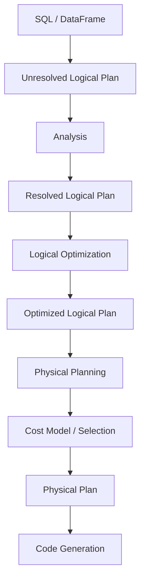

# 006 Catalyst Optimizer Internals

Canonical documentation for 006 Catalyst Optimizer Internals. This document defines concepts, terminology, and standard usage.

## Purpose
The Catalyst Optimizer exists to transform high-level declarative queries into highly efficient execution plans. Its primary purpose is to decouple the "what" of a data operation (expressed via SQL or functional APIs) from the "how" of execution. By utilizing a functional programming framework, it automates the application of heuristic and cost-based optimizations that would otherwise require manual tuning by data engineers.

> [!NOTE]
> This documentation is intended to be implementation-agnostic and authoritative regarding the architectural patterns of the Catalyst framework.

## Scope
Clarify what is in scope and out of scope for this topic.

**In scope:**
*   Tree-based data structures and manipulation.
*   The multi-phase optimization pipeline (Analysis, Logical Optimization, Physical Planning).
*   Rule-based and Cost-based optimization (RBO/CBO) mechanics.
*   Extensibility patterns for custom optimization rules.

**Out of scope:**
*   Specific vendor-proprietary extensions (e.g., Databricks Photon).
*   Hardware-specific instruction set optimizations.
*   Storage-layer specific indexing (unless abstracted via the optimizer).

## Definitions
Provide precise definitions for key terms.

| Term | Definition |
|------|------------|
| **Tree** | The fundamental data structure in Catalyst, composed of node objects representing expressions or operators. |
| **Rule** | A function that transforms one tree into another, typically using pattern matching to identify and replace specific sub-trees. |
| **Fixed-point** | A state where applying a rule or strategy no longer results in any changes to the tree, signaling the completion of an optimization phase. |
| **Unresolved Logical Plan** | A tree where column names and table references have not yet been validated against a catalog or schema. |
| **Resolved Logical Plan** | A tree where all identifiers are mapped to actual data types and attributes in a schema. |
| **Physical Plan** | A blueprint for execution that specifies the exact algorithms (e.g., HashJoin vs. SortMergeJoin) to be used. |
| **Expression** | A node in a tree that represents a value computation (e.g., `Addition`, `AttributeReference`). |

## Core Concepts

### Tree Representation
Every query is represented as a tree. Nodes in the tree represent either logical operators (like `Filter` or `Join`) or expressions (like `Sum` or `GreaterThan`). Trees are immutable; transformations result in new tree structures rather than modifying existing ones.

### Rule-Based Transformation
The optimizer operates through the recursive application of rules. A rule is a partial function that matches a specific pattern in the tree and returns a transformed version of that pattern. Rules are grouped into "Batches," and batches are executed until a fixed-point is reached or a maximum number of iterations is exceeded.

### Analysis
The first phase of the optimizer. It takes an "Unresolved" plan and uses a Catalog to map string identifiers to typed attributes. This phase ensures that the query is semantically valid (e.g., the column `user_id` actually exists in the table `users`).

### Logical Optimization
This phase applies standard relational algebra optimizations. These are generally "always good" transformations that do not depend on the underlying data distribution, such as constant folding or predicate pushdown.

### Physical Planning
The transition from "what" to "how." A single logical operator may have multiple physical implementations. The optimizer generates multiple physical plans and uses a cost model to select the most efficient one based on statistics.

## Standard Model

The standard Catalyst pipeline follows a linear progression through four distinct stages:

1.  **Analysis:** Resolving references using the Catalog.
2.  **Logical Optimization:** Applying rule-based heuristics (RBO).
3.  **Physical Planning:** Generating multiple physical candidates and selecting the optimal one via a Cost-Based Optimizer (CBO).
4.  **Code Generation:** Converting the selected physical plan into low-level bytecode or machine code for execution.

## Common Patterns

### Predicate Pushdown
Moving filters as close to the data source as possible to reduce the volume of data loaded into memory and processed in subsequent stages.

### Constant Folding
Evaluating expressions containing only constants at compile-time rather than execution-time (e.g., transforming `x < (2 + 3)` to `x < 5`).

### Projection Pruning
Removing columns from the execution plan that are not referenced in the final output or intermediate calculations, reducing I/O and memory overhead.

### Join Reordering
Using table statistics (cardinality, size) to determine the most efficient order to join multiple tables, minimizing the size of intermediate result sets.

## Anti-Patterns

### Opaque User-Defined Functions (UDFs)
Using black-box functions that the optimizer cannot inspect. This prevents the engine from performing optimizations like predicate pushdown or constant folding inside the UDF.

### Manual Optimization Overrides
Forcing specific join types or broadcast hints without updated statistics. This can lead to "brittle" pipelines that degrade in performance as data distributions shift.

### Over-Complex Expression Trees
Generating excessively deep trees (e.g., thousands of nested `CASE` statements) which can lead to significant overhead during the Analysis and Optimization phases, sometimes resulting in stack overflow errors.

## Edge Cases

### Non-Deterministic Expressions
Functions like `rand()` or `now()` prevent certain optimizations. For example, a filter containing a non-deterministic function cannot be easily pushed down or cached because its value changes per execution.

### Schema Evolution
When the underlying data schema changes between the Analysis phase and the Execution phase, the optimizer must handle potential type mismatches or missing attributes, often requiring a re-analysis of the plan.

### Cartesian Products
In the absence of join keys or adequate statistics, the optimizer may default to a nested loop join (Cartesian product), which is computationally expensive. The optimizer must have safety thresholds to warn or prevent these operations in production environments.

## Related Topics
*   **Relational Algebra:** The mathematical foundation for logical transformations.
*   **Cost-Based Optimization (CBO):** The specific logic used to weigh physical plan alternatives.
*   **Whole-Stage Code Generation:** The process of collapsing a physical plan into a single optimized function.
*   **Data Catalog/Metastore:** The source of truth for schema and statistics used during Analysis.

## Change Log

| Version | Date | Description |
|---------|------|-------------|
| 1.0 | 2026-01-11 | Initial AI-generated canonical documentation |