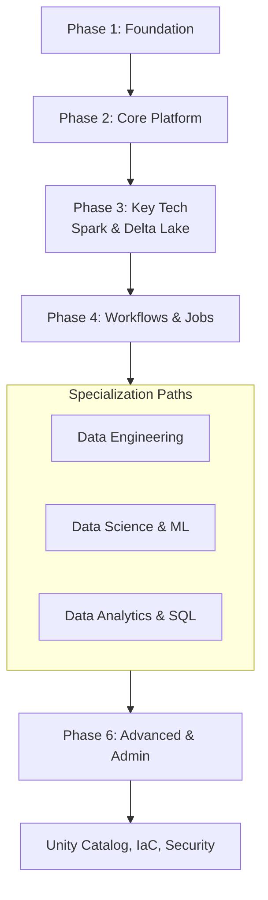

Of course! Here is a comprehensive roadmap to learn Databricks, designed to take you from a complete beginner to a proficient practitioner, and even to an advanced level.

This roadmap is broken down into phases, with key concepts and actionable steps for each.

### Guiding Philosophy
Databricks is not a single technology but a **unified platform**. Your learning path will involve understanding its core components and how they work together. The goal is to move from using it as a simple Spark engine to leveraging it as a cohesive data and AI platform.

---

### Phase 1: Foundation & Onboarding (The "What and Why")
**Goal:** Understand what Databricks is, why it's used, and get your first hands-on experience.

**Key Concepts:**
*   **What is Databricks?** The company, the Lakehouse Platform, and its relation to Apache Spark.
*   **The Lakehouse Paradigm:** Combining the best of Data Lakes (low-cost storage) and Data Warehouses (performance & management).
*   **Core Architecture:** Workspace, Clusters, Notebooks.
*   **Key Personas:** Data Engineer, Data Scientist, Data Analyst. Understand which one you align with.

**Actionable Steps:**
1.  **Read the Official "What is Databricks?" Documentation.**
2.  **Sign up for the Community Edition:** This is a free, limited-capacity version perfect for learning. [Databricks Community Edition](https://community.cloud.databricks.com/).
3.  **Complete the "Getting Started with Databricks" tutorial** on their website. It will guide you through creating your first cluster and running a notebook.
4.  **Familiarize yourself with the Workspace UI:** Learn how to navigate, create folders, and import a sample notebook.

---

### Phase 2: Core Platform Proficiency (The "How")
**Goal:** Become comfortable with the day-to-day tools and execution environment.

**Key Concepts:**
*   **Workspace & Navigation:** Projects, Repos, Folders.
*   **Clusters:** Difference between All-Purpose and Job Clusters. Understanding driver vs. worker nodes, cluster configurations, and policies.
*   **Notebooks:** Primary tool for interactive development. Learn magic commands (`%python`, `%sql`, `%md`), attaching a notebook to a cluster, and running cells.
*   **Databricks File System (DBFS):** The distributed file system layered over cloud object storage (S3, ADLS, GCS). Learn how to read from and write to it.
*   **Basic Data Operations:** Reading/writing data in various formats (CSV, JSON, Parquet, Delta Lake).

**Actionable Steps:**
1.  **Create your own All-Purpose Cluster** in the Community Edition.
2.  **Create a new Notebook** and practice using different languages (Scala, Python, SQL, R) in different cells.
3.  **Upload a small CSV file to DBFS** and write PySpark code in a notebook to read it and display the first few rows.
4.  **Write the data back to DBFS in Parquet format.**
5.  **Explore the Cluster UI** to understand metrics and event logs.

---

### Phase 3: Deep Dive into Key Technologies (The "Power")
**Goal:** Master the core technologies that make Databricks powerful.

#### 3.1. Apache Spark
*   **Concept:** The core computation engine. Understand RDDs, DataFrames, and Datasets.
*   **Focus:** Spark SQL and DataFrames API (this is the most common way to use Spark today).
*   **Learn:** Transformations vs. Actions, Lazy Evaluation, Partitioning.

#### 3.2. Delta Lake (***CRITICAL***)
*   **Concept:** The storage layer that brings reliability (ACID transactions) to data lakes.
*   **Key Features:** `MERGE`, `UPDATE`, `DELETE`, Time Travel, Schema Evolution, Change Data Feed.
*   **Why it's important:** This is the foundation of the Lakehouse. Most tables in Databricks should be Delta tables.

#### 3.3. Databricks Runtime
*   **Concept:** The optimized version of Spark that Databricks provides.
*   **Understand:** The difference between Standard, ML, and Photon runtimes.

**Actionable Steps:**
1.  **Convert the Parquet file from Phase 2 into a Delta Table** using `df.write.format("delta").save(...)` or `CREATE TABLE USING DELTA`.
2.  **Practice Delta Lake Operations:**
    *   Perform an `UPDATE` on your Delta table.
    *   Use `DESCRIBE HISTORY` to see the table history.
    *   **Time Travel:** Query the data as it was at a previous version.
3.  **Complete the official "Intro to DataFrames" and "Delta Lake" tutorials** on Databricks Academy.

---

### Phase 4: Workflow Management & Production (The "Orchestration")
**Goal:** Learn how to move from interactive development to scheduled, production-grade workflows.

**Key Concepts:**
*   **Databricks Jobs:** How to schedule a notebook or JAR to run.
*   **Workflows (formerly Delta Live Tables):** A declarative ETL framework to build reliable, maintainable, and testable data pipelines.
    *   Learn the syntax (`@dlt.view`, `@dlt.table`).
    *   Understand expectations for data quality (`expect`, `expect_or_drop`, `expect_or_fail`).
*   **Orchestration with External Tools:** How Databricks integrates with tools like Apache Airflow, Azure Data Factory, etc.

**Actionable Steps:**
1.  **Schedule your ETL notebook as a Job:** Use the Jobs UI to create a one-time or scheduled job.
2.  **Build a simple DLT Pipeline:** Create a pipeline that ingests a CSV file, applies a simple transformation, and writes to a Delta table. Define a data quality expectation.
3.  **(Optional) Trigger a Databricks Job from an external orchestrator** like Azure Data Factory or a simple script using the Databricks REST API.

---

### Phase 5: Specialization Paths (The "Expertise")
Choose one or more paths based on your career goals.

#### Path A: Data Engineering
*   **Advanced Spark Tuning:** Understanding joins, shuffles, caching, and the Catalyst Optimizer.
*   **Medallion Architecture:** Bronze (Raw), Silver (Validated), Gold (Enriched) layer design.
*   **Change Data Capture (CDC):** Using `MERGE` for SCD (Slowly Changing Dimensions) Type 1 and 2.
*   **Performance Optimization:** Using `EXPLAIN`, Photon Engine, and optimizing file sizes.
*   **Tools:** `dbx` (Databricks CLI for deployment), Terraform for infrastructure-as-code.

#### Path B: Data Science & Machine Learning
*   **MLflow:** The cornerstone for the ML lifecycle (tracking, projects, models, registry).
*   **Databricks Runtime for ML:** Pre-installed with major ML libraries.
*   **Feature Store:** Create, manage, and serve features for model training and inference.
*   **AutoML:** Use Databricks AutoML to automatically train and evaluate models.
*   **Collaborative Projects:** Using Repos for Git integration.

#### Path C: Data Analytics & SQL
*   **Databricks SQL (DB SQL):** The serverless data warehouse endpoint.
*   **SQL Warehouses:** Creating and configuring.
*   **Dashboards & Alerts:** Building interactive dashboards and setting up query-based alerts.
*   **Delta Engine:** The high-performance query engine for SQL on Delta Lake.

---

### Phase 6: Advanced Topics & Administration (The "Guru")
**Goal:** Understand platform governance, security, and advanced use cases.

**Key Concepts:**
*   **Unity Catalog:** Unified governance for data and AI on the Lakehouse. (Master this! It's the future).
    *   Manage data access with SQL `GRANT` and `REVOKE`.
    *   Understand three-level namespace: `catalog.schema.table`.
*   **Security & Access Control:** Cluster policies, credential passthrough, and SCIM integration.
*   **Platform Governance:** Managing users, groups, and workspaces.
*   **Infrastructure as Code (IaC):** Using the Databricks Terraform Provider to manage your entire platform.

### Recommended Learning Resources

1.  **Official Databricks Academy (Free & Paid):** This is the **best place to start**. They have fantastic, role-specific learning paths. [Databricks Academy](https://academy.databricks.com/)
2.  **Documentation:** The official docs are excellent. Use them as your primary reference. [Databricks Docs](https://docs.databricks.com/)
3.  **Books:**
    *   *Spark: The Definitive Guide* (for deep Spark knowledge)
    *   *Learning Databricks* (for a platform overview)
4.  **Community:**
    *   **Databricks Community Forums:** A great place to ask questions. [Community Forums](https://community.databricks.com/)
    *   **YouTube:** Databricks channel has excellent talks and demos from the Data + AI Summit.

### Visual Roadmap Summary

**Final Advice:** **Learn by doing.** Don't just read. Use the Community Edition to follow along with every concept. Build a small end-to-end project that ingests data, transforms it, and builds a dashboard or a model. This hands-on experience is invaluable. Good luck
